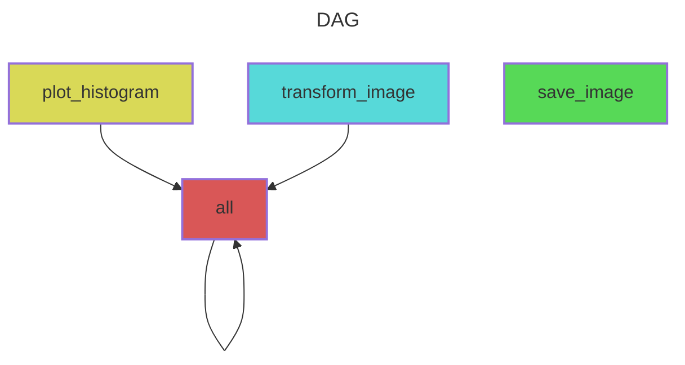

# snakemake-learning
GitHub Repository for the hands-on snakemake learn session at the MannLabs Group Retreat 2025

Snakemake is a python-based workflow manager that is supposed to make your life easier when analysing large datasets. It **enforces reproducibility** and **enables scalability**. 

In this tutorial, we will 
1. read in a dataset
2. process it with a simple function
3. generate a plot as output
4. generate a report. 


## Installation 

1. Using the command line, go into your favorite directory (`cd /path/to/my/favorite/directory`)

2. Clone this repository 

```shell 
git clone https://github.com/lucas-diedrich/snakemake-learning.git
```

(or download it via `Code > Download ZIP`, and unzip it locally)

3. Go into the directory

```shell 
cd snakemake-learning
```

4. Create a `conda`/`mamba` environment with snakemake based on the `environemnt.yaml` file and activate it

```shell 
mamba create -n snakemake-env --file environment.yaml && mamba activate snakemake-env

# OR conda create -n snakemake-env --file environment.yaml && conda activate snakemake-env
```

5. Check if the installation was successful

```shell
snakemake --version
> 9.5.1
```


## Tutorial

### 1. Snakemake - Introduction 

See the slides in `./docs`

### 2. Check out the workflow 

Run the following command in the root directory (`.`) to se the whole task graph. 

```shell
# --dag: Directed acyclic graph
# mermaid-js: A format to visualize graphs
snakemake --dag mermaid-js
```

And the following command to inspect how the rules depend on one another (simpler than task graph, especially for large workflows)

```shell
# --rulegraph: Show dependencies between rules
# mermaid-js: A format to visualize graphs
snakemake --rulegraph mermaid-js
```



And use the [`mermaid.live`](https://mermaid.live) editor to view the task graph

## References

- **Snakemake homepage + Documentation** [snakemake.readthedocs.io](https://snakemake.readthedocs.io/en/stable/index.html)

- **Publication** Mölder F, Jablonski KP, Letcher B et al. Sustainable data analysis with Snakemake [version 2; peer review: 2 approved]. F1000Research 2021, 10:33 (https://doi.org/10.12688/f1000research.29032.2)