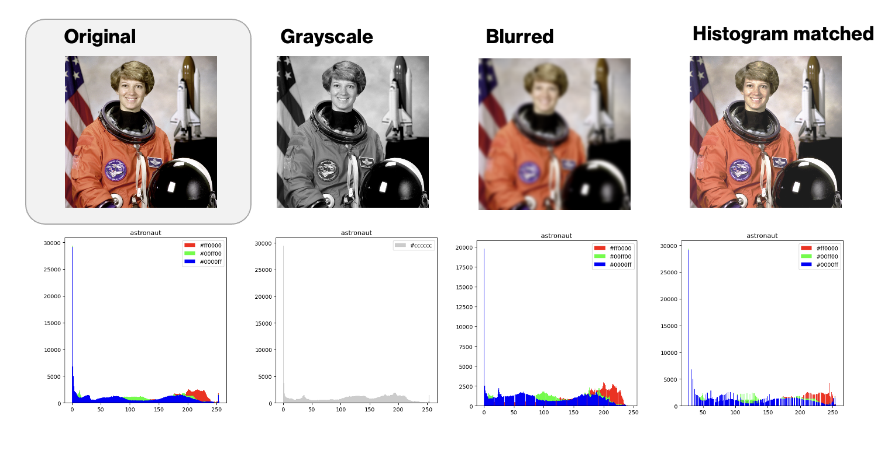
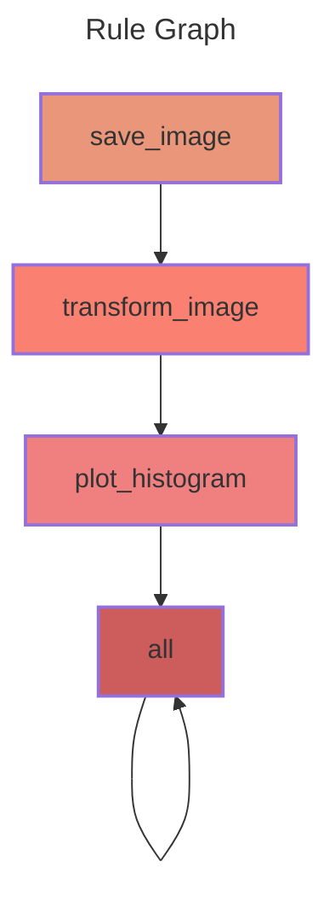

# snakemake-learning
GitHub Repository for the hands-on snakemake learn session at the MannLabs Group Retreat 2025

Snakemake is a python-based workflow manager that is supposed to make your life easier when analysing large datasets. It **enforces reproducibility** and **enables scalability**. 

### Tutorial overview

In this tutorial, we will 
1. read in a dataset (here: a small image)
2. process it with a simple function (here: apply different image transformations to it)
3. generate a plot as output (here: histograms of pixel intensities)
4. generate a snakemake report.





## Installation 

**The instructions need to be minimally modified to enable users with mamba installations to follow along. Please use the branch _mamba-local_ and follow along the installation instructions on that branch, if you do not have `conda` available on your system**

1. Using the command line, go into your favorite directory (`cd /path/to/my/favorite/directory`)

2. Clone this repository 

```shell 
git clone https://github.com/lucas-diedrich/snakemake-learning.git
```

(or download it via `Code > Download ZIP`, and unzip it locally)

3. Go into the directory

```shell 
cd snakemake-learning
```

4. Create a `conda`/`mamba` environment with snakemake based on the `environemnt.yaml` file and activate it

```shell 
mamba create -n snakemake-env --file environment.yaml && mamba activate snakemake-env

# OR conda create -n snakemake-env --file environment.yaml && conda activate snakemake-env
```

5. Check if the installation was successful

```shell
snakemake --version
> 9.5.1
```

## Tutorial

### 1. Snakemake - Introduction 

See the slides in `./docs`

### 2. Check out the workflow 

Run the following command in the root directory (`.`) to se the whole task graph. 

```shell
# --dag: Directed acyclic graph
snakemake --dag 
```

And the following command to inspect how the rules depend on one another (simpler than task graph, especially for large workflows)

```shell
# --rulegraph: Show dependencies between rules
snakemake --rulegraph
```



You can use this [`grapviz visualizer`](https://dreampuf.github.io/GraphvizOnline/) editor to view the task graph


### 3. Run the full workflow 

Go in the `./workflow` directory and run:

```shell
snakemake --cores 2 --use-conda
```

The output can be found in the `./results` directory

### Generate the report 

Go in the `./workflow` directory and run 

```shell
snakemake --report ../results/report.html
```

The output can be found in the `./results` directory


## Exercises 

*To further deepen your understanding after the workshop.*

### 1. Scale the workflow to other images 

The script `create-data.py` can take image names (that are part of the `skimage` package) as arguments. 

```shell
python scripts/create-data.py --image-name <image name> --output <output name>
```
Modify the workflow in a way that it also (=in addition) runs on other `skimage` example datasets, e.g. `colorwheel, cat, logo`

### 2. Add a rule 

Add a new rule in which you generate an aggregated plot - where the image and its modifications are shown in the top row and the associated histograms are shown in the bottom row. 


### 3. Prettify the report

Explore possibilities to modify the report with the rich structured text format. 


## References

- **Snakemake homepage + Documentation** [snakemake.readthedocs.io](https://snakemake.readthedocs.io/en/stable/index.html)

- **Publication** Mölder F, Jablonski KP, Letcher B et al. Sustainable data analysis with Snakemake [version 2; peer review: 2 approved]. F1000Research 2021, 10:33 (https://doi.org/10.12688/f1000research.29032.2)